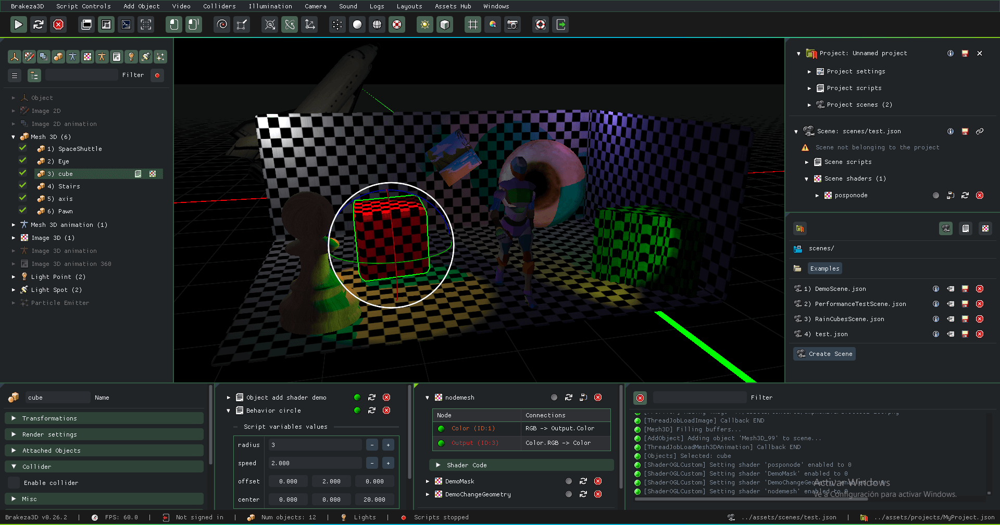
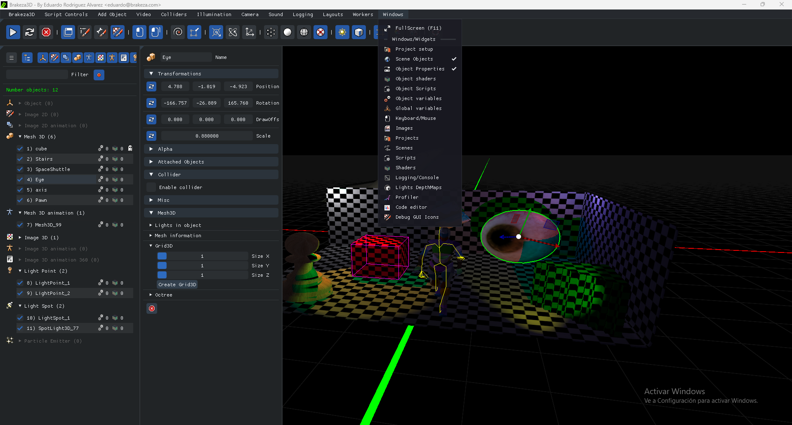
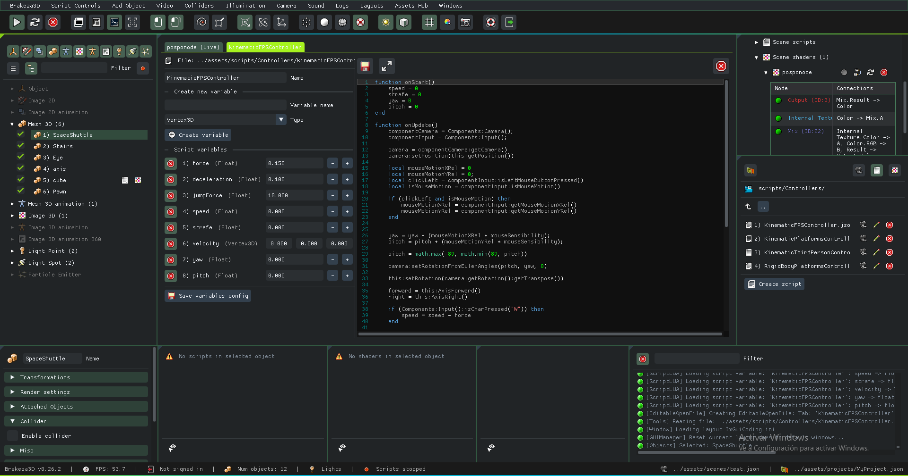
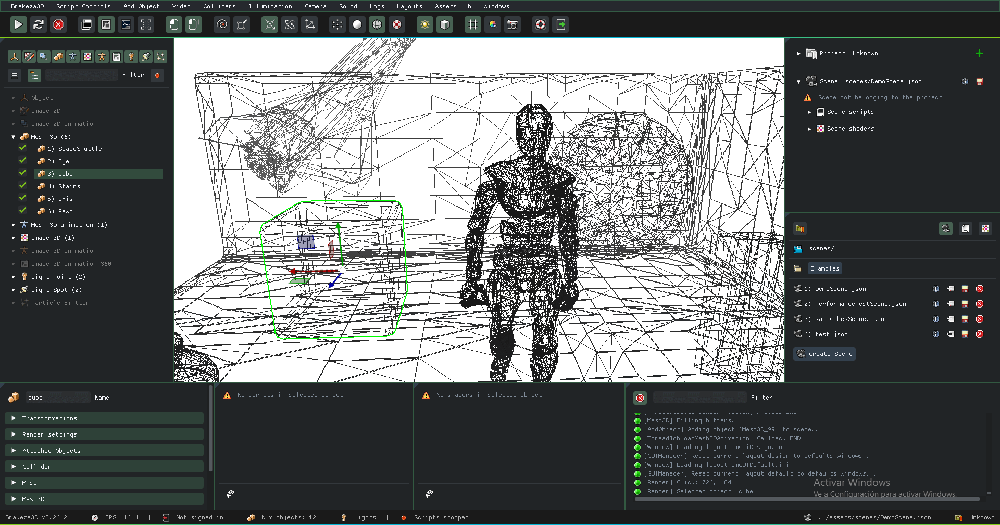
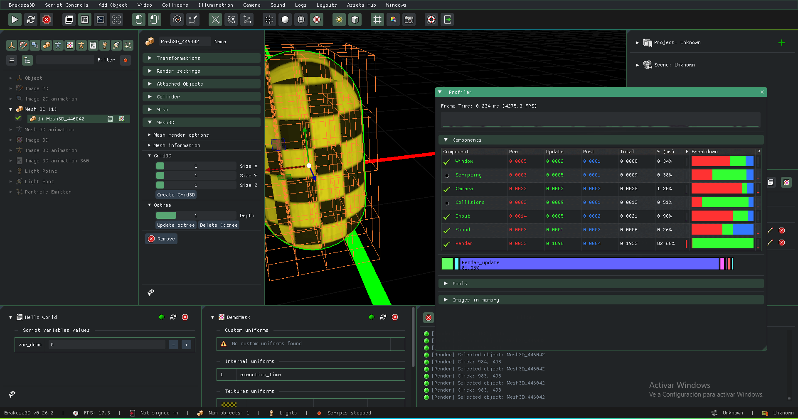

#  Brakeza3D Game Engine

### A Powerful 2D/3D Game Engine for Indie Developers

[](https://www.gnu.org/licenses/gpl-3.0)
[](https://github.com/rzeronte/brakeza3d/releases)
[](https://brakeza.com/downloads)
[](https://isocpp.org/)

[🌐 Website](https://brakeza.com) • [📖 Documentation](https://brakeza.com/docs/getting-started/intro) • [⬇️ Downloads](https://brakeza.com/downloads) • [🎨 Gallery](https://brakeza.com/gallery) • [💬 Blog](https://brakeza.com/blog)




---

## 🚀 What is Brakeza3D?

**Brakeza3D** is a free, open-source game engine written from scratch in **C++**, designed for flexibility, learning, and complete control over the rendering pipeline. Built with a clean, component-based architecture, it empowers indie developers and small teams to prototype and build games quickly and efficiently.

Whether you're learning graphics programming, prototyping game ideas, or building small to medium real-time projects, Brakeza3D provides an intuitive yet powerful toolset.

### ✨ Key Highlights

- 🎯 **Dual 2D/3D Workflow** — Seamlessly work with both 2D and 3D content
- 🎨 **Visual Shader Editor** — Node-based shader creation alongside GLSL support
- 📝 **Lua Scripting** — Write game logic without recompilation
- 🛠️ **Integrated Editor** — Drag-and-drop interface with real-time preview
- ⚡ **High Performance** — Modern OpenGL with optimized rendering pipeline
- 🌍 **Cross-Platform** — Windows, Linux, and macOS support

---

## 📦 Quick Start

### Pre-built Binaries

Download ready-to-use binaries for your platform:

- **Windows 10/11** (x86_64): [Download .exe](https://github.com/rzeronte/brakeza3d/releases/download/precompiled-libs/Brakeza3D-x86-64-Windows-installer.exe) (66.7 MB)
- **Ubuntu/Debian** (x86_64): [Download .deb](https://github.com/rzeronte/brakeza3d/releases/download/precompiled-libs/Brakeza3D-x86-64-Linux-installer.deb) (89 MB)

### Build from Source
```bash
git clone https://github.com/rzeronte/brakeza3d.git
cd brakeza3d
mkdir build && cd build
cmake ..
make
```

📖 **For detailed build instructions, dependencies, and platform-specific guides**, see the [full documentation](https://brakeza.com/docs/getting-started/download-and-install).

---

## 🎯 Features

### 🎨 Rendering & Graphics
- **Forward and Deferred rendering** pipelines
- **Shadow mapping** with configurable quality
- **ADS lighting system** (Ambient, Diffuse, Specular)
- **Extensible GLSL shaders** + visual node-based editor
- Modern **OpenGL** rendering

### 🛠️ Development Tools
- **Dockable GUI** with intuitive drag & drop
- **Integrated profiler** for performance analysis
- **Code editor** with syntax highlighting (Lua/GLSL)
- **Scene management** system
- **Real-time preview** in editor

### ⚙️ Core Systems
- **Cross-platform** (Windows / Linux / macOS)
- **Multi-threading** support (thread pool based)
- **Physics world integration** (Bullet Physics)
- **Sound system** integration (SDL2_mixer)
- **Assimp library** for 3D model loading

### 🎮 Scripting & Input
- **Lua 5.2 scripting** with full engine API access
- **Gamepad support** (Xbox / PlayStation controllers)
- Component-based architecture for easy extensibility

---

## 🏗️ Built With

| Technology | Purpose |
|-----------|---------|
| [C++](https://isocpp.org) | Core engine language |
| [SDL2](https://www.libsdl.org) | Window management & input |
| [OpenGL](https://www.opengl.org) | Graphics rendering |
| [Bullet Physics](https://pybullet.org) | Physics simulation |
| [Assimp](https://www.assimp.org) | 3D model importing |
| [Lua 5.2](https://www.lua.org) | Scripting |
| [ImGui](https://github.com/ocornut/imgui) | Editor interface |
| [GLM](https://github.com/g-truc/glm) | Mathematics library |

---

## 📸 Gallery

<div align="center">

| Editor Interface | Node-Based Shaders | 3D Scene |
|:---:|:---:|:---:|
|  |  |  |

| Lighting System | Physics Demo | Material Editor |
|:---:|:---:|:---:|
|  |  |  |

[View Full Gallery →](https://brakeza.com/gallery)

</div>

---

## 📚 Documentation

- **[Getting Started Guide](https://brakeza.com/docs/getting-started/intro)** — First steps with Brakeza3D
- **[Editor Manual](https://brakeza.com/docs/editor/overview)** — Learn the editor interface
- **[Engine Concepts](https://brakeza.com/docs/engine-concepts/script-controls)** — Understand core systems
- **[Scripting API](https://brakeza.com/docs/scripting-api/index)** — Complete Lua API reference
- **[Advanced Topics](https://brakeza.com/docs/advanced/core-shaders)** — Deep dive into engine internals

---

## 🎓 Project Status

Brakeza3D is under **active development** (currently v0.26.1). Some systems and APIs may change, and certain features are still experimental.

**Current suitability:**
- ✅ Learning graphics and engine architecture
- ✅ Rapid prototyping
- ✅ Small to medium real-time projects
- ⚠️ Production-ready games (experimental features)

---

## 🌍 Community

Join the Brakeza3D community and stay updated:

- 🐦 [Twitter](https://twitter.com/brakeza3d) — Latest news and updates
- 📺 [YouTube](https://youtube.com/@brakeza3d) — Tutorials and showcases
- 💼 [LinkedIn](https://www.linkedin.com/in/eduardo-rodr%C3%ADguez-1796b8172/) — Connect with the creator
- 📝 [Blog](https://brakeza.com/blog) — Development insights

---

## 📄 License

This project is licensed under the **GNU General Public License v3.0 (GPL-3.0)**.

You are free to use, modify, and distribute this software, provided that:
- Derivative works are also licensed under GPL-3.0
- Source code is made available
- Copyright and license notices are preserved

For full details, see the [LICENSE](LICENSE) file or visit [gnu.org/licenses/gpl-3.0](https://www.gnu.org/licenses/gpl-3.0.html).

---

## 💖 Support the Project

If you find Brakeza3D useful, consider:
- ⭐ Starring this repository
- 🐛 Reporting issues or bugs
- 💡 Suggesting new features
- 📖 Contributing to documentation
- 🔧 Submitting pull requests

---

<div align="center">

**Made with ❤️ by [Eduardo Rodríguez Álvarez](https://brakeza.com)**

[Website](https://brakeza.com) • [GitHub](https://github.com/rzeronte/brakeza3d) • [Docs](https://brakeza.com/docs/getting-started/intro)

</div>